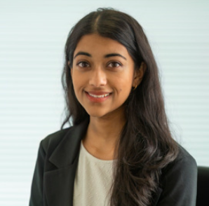

<!-- > **_Update:_** Text here -->

<!--  -->

I am a senior research fellow at Northeastern University. In Spring 2026, I will start as an assistant professor in Northeastern's [Khoury College of Computer Sciences](https://www.khoury.northeastern.edu/). I am interested in the sociotechnical dynamics of modernizing data practices, with a focus on privacy and data access.
 
I completed my PhD in Computer Science (with a secondary in Science & Technology Studies) at Harvard University, where I was fortunate to be advised by [Salil Vadhan](https://salil.seas.harvard.edu/) and [Jonathan Zittrain](https://hls.harvard.edu/faculty/jonathan-l-zittrain/) and work within the [OpenDP](https://opendp.org/) team. My dissertation investigates the technical, social, and political dimensions of differential privacy. I then had a wonderful postdoc year at Columbia University's [Data Science Institute](https://datascience.columbia.edu/), advised primarily by [Rachel Cummings](https://rachelcummings.com/).
 
Previously, I was a graduate fellow at the [Edmond and Lily Safra Center for Ethics](https://ethics.harvard.edu/) and an intern at Microsoft Research's [Social Media Collective](https://socialmediacollective.org/) mentored by [danah boyd](http://www.danah.org/). Before that, I played four years of varsity golf at Yale University.<i class="em em-woman-golfing" aria-role="presentation" aria-label="GOLF"></i>
 
If you are interested in working with me as a PhD student, postdoc, or collaborator, please reach out!

### Selected Work

**Centering Policy and Practice: Research Gaps around Usable Differential Privacy**\
with Rachel Cummings\
IEEE Conference on Trust Privacy and Security in Intelligent Systems and Applications, 2023.\
[arXiv](https://arxiv.org/abs/2406.12103) | [publisher's version](https://www.computer.org/csdl/proceedings-article/tps-isa/2023/238500a122/1UAj4IqN4sg)
 
**Dont Look at the Data! How Differential Privacy Reconfigures the Practices of Data Science**\
with Sophia Song, Audrey Haque, Tania Schlatter, and Salil Vadhan\
ACM CHI Conference on Human Factors in Computing Systems, 2023\
Presented at Theory and Practice of Differential Privacy, 2022.\
[arXiv](https://arxiv.org/abs/2302.11775) | [publisher's version](https://dl.acm.org/doi/abs/10.1145/3544548.3580791)
 
**Differential Perspectives: Epistemic Disconnects Surrounding the US Census Bureau’s Use of Differential Privacy**\
with danah boyd\
Harvard Data Science Review, 2022.\
Presented at Privacy Law Scholars Conference, 2022.\
[SSRN](https://papers.ssrn.com/sol3/papers.cfm?abstract_id=4077426) | [publisher's version](https://hdsr.mitpress.mit.edu/pub/3vj5j6i0)

<i class="fas fa-envelope"></i> j.sarathy [at] northeastern [dot] edu  

<i class="fas fa-envelope"></i> 177 Huntington Ave, 606  

